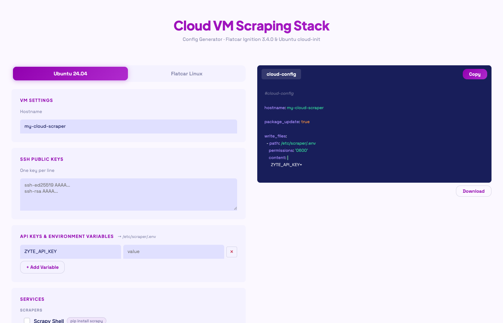

# spawn-cloud-scraper

A single-file web app that generates ready-to-paste bootstrap configs for cloud VMs running a web scraping stack. Fill a form, click Copy (or Download), paste into your cloud provider's user-data field — done.

**Live:** https://zytelabs.github.io/spawn-cloud-scraper



---

## What

Two output modes:

| Mode | Output | Use with |
|---|---|---|
| **Ubuntu 24.04** | `#cloud-config` YAML | Any cloud provider — paste into user-data |
| **Flatcar Linux** | Butane YAML + Ignition JSON | Flatcar-capable providers — paste Ignition JSON |

Services you can include:

| Service | Ubuntu | Flatcar |
|---|---|---|
| Scrapy | native pip | python:3.11-slim container |
| Playwright Python | native pip + chromium | mcr.microsoft.com/playwright/python |
| Puppeteer | native npm | ghcr.io/puppeteer/puppeteer |
| Splash (JS renderer) | — Docker only | scrapinghub/splash |
| Redis | apt | redis:7-alpine |
| PostgreSQL | apt | postgres:16-alpine |
| Tor Proxy | apt | dperson/torproxy |
| mitmproxy | native pip | mitmproxy/mitmproxy |

Everything is self-contained in `index.html` — no build step, no dependencies, no backend.

---

## Why

Spinning up a scraping VM by hand means installing tools one by one, writing systemd units, figuring out docker-compose syntax, and copy-pasting SSH keys. This tool collapses that into a 30-second form.

It also handles the subtle differences between cloud-init (Ubuntu) and Ignition (Flatcar) so you don't have to look up the spec every time.

---

## How it works

```
collectFormState()
  └─ { hostname, sshKeys[], envVars[], services[], scrapyGitUrl }
       ├─ renderCloudConfig(state)  → #cloud-config YAML   (Ubuntu mode)
       ├─ renderButane(state)       → Butane YAML           (Flatcar mode)
       └─ renderIgnition(state)     → Ignition JSON 3.4.0   (Flatcar mode)
```

- **Ubuntu**: selected services collapse into a deduplicated `packages:` list and `runcmd:` list
- **Flatcar**: services become a single `docker-compose.yml` + a `scraper.service` systemd unit that pulls and starts all containers on boot
- Env vars land at `/etc/scraper/.env` on the VM in both modes

---

## Usage

### Web UI

1. Open the app (link above or `index.html` locally)
2. Choose **Ubuntu 24.04** or **Flatcar Linux**
3. Fill in hostname, SSH public keys, and any API keys / env vars
4. Check the services you want
5. *(Optional)* If you checked **Scrapy**, a **Scrapy Project** field appears — paste a Git repo URL to have your project cloned onto the VM on first boot (see below)
6. Click **Copy** or **Download** — the filename is pre-set for the right CLI tool

### Scrapy Project (optional)

When the **Scrapy** service is selected, a **Git repository URL** field appears. Paste any public or private Git URL and the config will clone it automatically on first boot:

| Mode | What happens |
|---|---|
| **Ubuntu** | `git clone <url>` runs in `runcmd:` → project lands at `/home/ubuntu/<repo-name>/`. If a `requirements.txt` is present it is installed via pip. |
| **Flatcar** | The scrapy container installs git, clones into `/project` (inside the container), and installs `requirements.txt` if present — all as part of container startup. |

**Private repos** — embed a personal access token directly in the URL:

```
https://<token>@github.com/your-org/your-repo.git
```

The token will be visible in the generated config, which is intentional — it's only ever pasted into your own cloud provider's user-data field.

---

### CLI deployment

#### DigitalOcean — Ubuntu cloud-init

```bash
# Install doctl — https://docs.digitalocean.com/reference/doctl/how-to/install/
# macOS:  brew install doctl
# Linux:  snap install doctl  (or download binary from GitHub releases)
# Windows: choco install doctl  (or download binary from GitHub releases)
doctl auth init

# Deploy
doctl compute droplet create my-scraper \
  --region nyc3 \
  --size s-2vcpu-4gb \
  --image ubuntu-24-04-x64 \
  --ssh-keys $(doctl compute ssh-key list --no-header --format FingerPrint) \
  --user-data-file ./cloud-config.yaml \
  --wait

# Verify
ssh ubuntu@<ip> cat /var/log/cloud-init-output.log
```

#### Vultr — Flatcar + Ignition

```bash
# Install vultr-cli
brew install vultr/vultr-cli/vultr-cli

# Set your API key (Vultr dashboard → Account → API)
export VULTR_API_KEY="your_api_key_here"
# Persist it:
echo 'export VULTR_API_KEY="your_api_key_here"' >> ~/.zshrc

# Deploy (Chicago, shared CPU, 1 vCPU / 1 GB RAM / 25 GB, $5/mo)
vultr-cli instance create \
  --region ord \
  --plan vc2-1c-1gb \
  --os 2077 \
  --userdata-file ignition.json \
  --label my-cloud-scraper

# Get the IP once active
vultr-cli instance list

# Verify the stack came up
ssh -i ~/.ssh/your_key core@<ip> "sudo systemctl status scraper.service"
ssh -i ~/.ssh/your_key core@<ip> "sudo docker ps"
```

**OS IDs for Flatcar:**

| ID | Channel |
|---|---|
| `2075` | LTS |
| `2077` | Stable (recommended) |
| `2078` | Beta |
| `2079` | Alpha |

**Test each service after deploy:**

```bash
# Scrapy — drop into an interactive scrapy shell
ssh -i ~/.ssh/your_key core@<ip> \
  "sudo docker exec -it scraper-scrapy-1 scrapy shell https://example.com"

# Redis
ssh -i ~/.ssh/your_key core@<ip> \
  "sudo docker exec -it scraper-redis-1 redis-cli ping"
# → PONG

# Redis — from your local machine
redis-cli -h <ip> -p 6379 ping

# Splash (JS renderer)
curl http://<ip>:8050/

# mitmproxy
curl http://<ip>:8080/

# Tor — verify exit node
curl --socks5 <ip>:9050 https://check.torproject.org/api/ip

# PostgreSQL
psql -h <ip> -U postgres
```

---

## Cloud provider support

### Ubuntu cloud-init

Works on any provider that passes user-data through to cloud-init:

- AWS EC2
- Google Cloud (GCE)
- Azure
- DigitalOcean
- Hetzner Cloud
- Linode / Akamai
- Vultr
- OVHcloud
- Scaleway
- Oracle Cloud (OCI)
- Any OpenStack-based provider

### Flatcar + Ignition

Requires a provider that offers Flatcar as an OS image:

| Provider | Support |
|---|---|
| AWS EC2 | Flatcar AMI in marketplace |
| Google Cloud | Flatcar image available |
| Azure | Flatcar in Marketplace |
| Hetzner Cloud | Flatcar snapshot available |
| Vultr | Built-in OS option |
| Equinix Metal | First-class Flatcar support |
| OpenStack | Works with custom Flatcar image |

---

## License

MIT — see [LICENSE](LICENSE)
